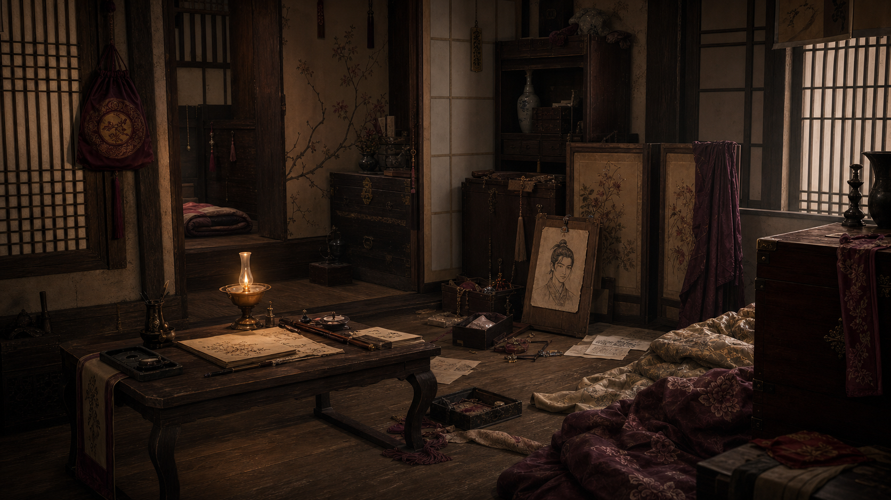
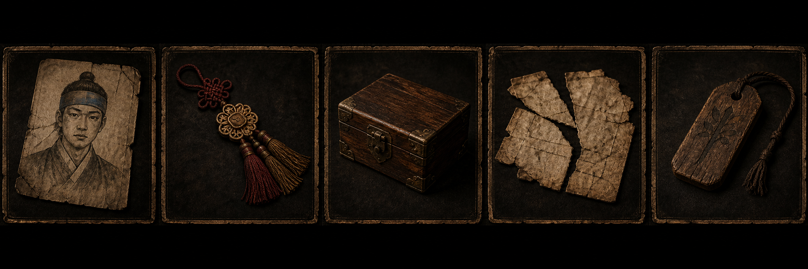
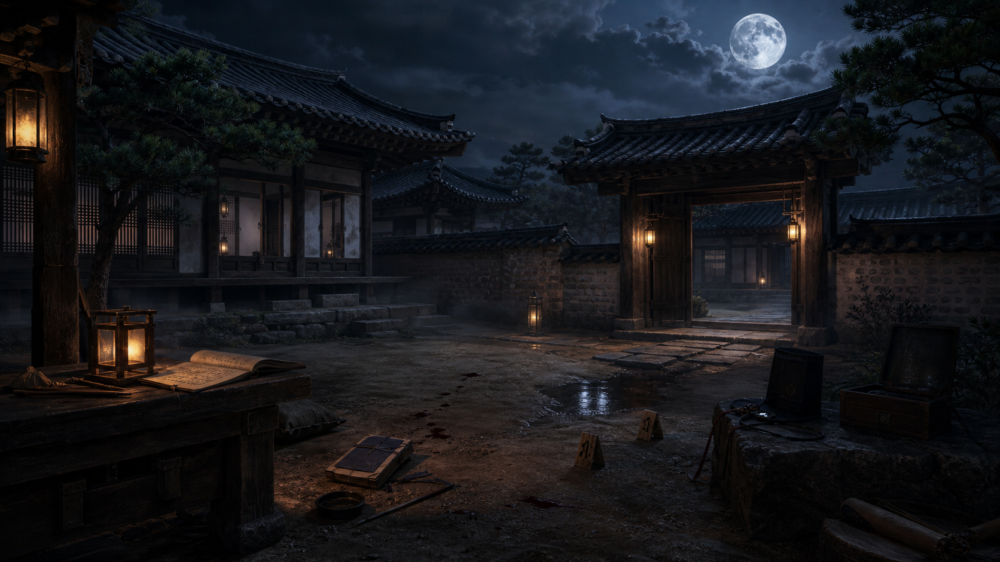
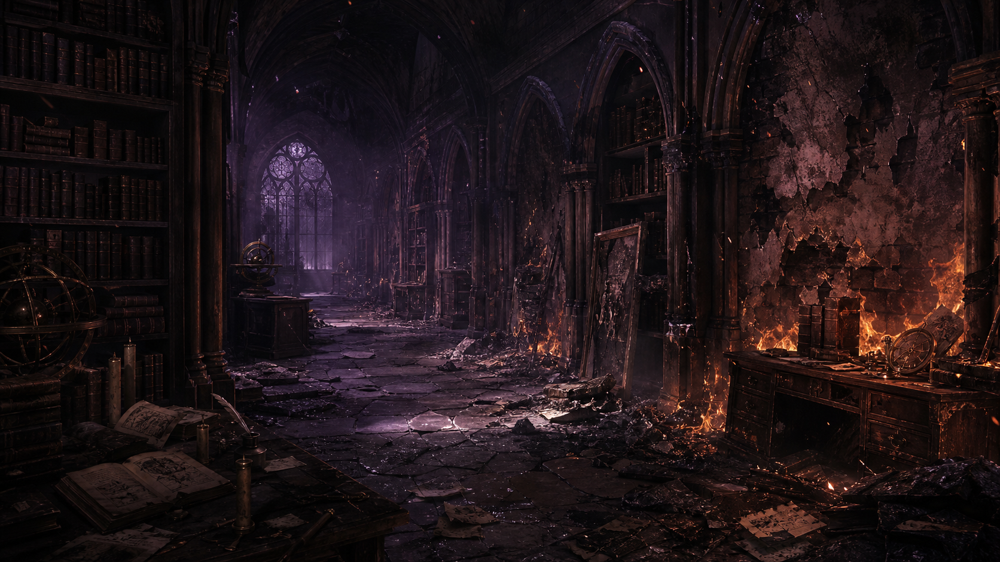
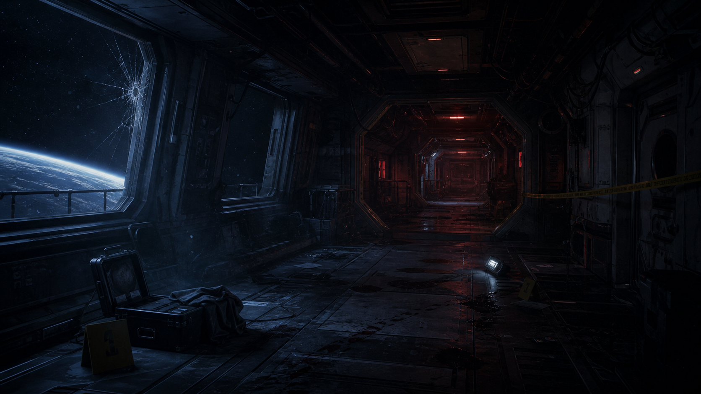
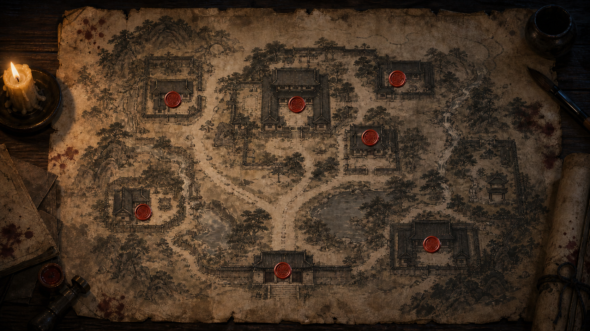

# 삼운몽: 세 개의 꿈 - 디자인 문서

## 1. 서비스 개요

- **장르:** 미스터리 추리 어드벤처 게임
- **핵심 경험:** 플레이어가 꿈속에서 특정 역할을 맡고, 조선시대 사건 현장을 조사하며, 증거와 진술의 모순을 찾아 범인을 지목한다.
- **현재 구현 범위:** 우선 조선시대 테마만 제작한다. 불탄 서재와 우주 정거장 이미지는 이후 다른 사건으로 확장할 때 참고할 후보 자료로 둔다.
- **확정된 방향:** 세 개의 꿈은 실제 시간대나 피해자의 기억이 아니라 플레이어의 환상이다. 플레이어는 꿈을 꾸는 인물이지만, 꿈 안에서는 사건을 조사하는 역할을 맡는다.
- **구현 방향:** 앞으로 게임은 Next.js 기반으로 구현한다.
- **문서 상태:** 사용자 결정과 이미지 기반 사실을 반영한 디자인 초안이다. 용의자 관계와 상세 스토리는 사용자가 이미 정해둔 내용이 있으므로 추후 별도로 확인한다.

## 2. 소스 자료

| 자료 | 레퍼런스 이미지 | 보이는 요소 | 디자인에 반영할 사실 |
|---|---|---|---|
| 이미지 1 |  | 메인 타이틀, `삼운몽: 세 개의 꿈`, `NEW DREAM / CONTINUE / SETTINGS / EXIT`, 한옥, 달, 범죄 현장, 우주 공간 | 게임 제목과 메뉴 구조의 방향이 보인다. 전통, 오컬트, SF, 범죄 수사가 한 화면에서 결합된다. |
| 이미지 2 |  | 새벽 안개 낀 한옥 골목, 쓰러진 인물, 편지, 노리개 형태의 물건 | 초반 사건 현장 또는 첫 번째 꿈의 살인 현장으로 사용할 수 있다. |
| 이미지 3 |  | 한옥 내부 방, 촛불, 문서, 초상화, 보관함, 흐트러진 침구 | 실내 조사 장면, 인물의 사적 공간, 숨겨진 단서 수색에 적합하다. |
| 이미지 4 |  | 증거 카드 UI, 초상화, 장신구, 나무 상자, 찢어진 문서, 목패 | 증거 인벤토리 UI의 시각 기준으로 사용할 수 있다. |
| 이미지 5 |  | 달밤 한옥 마당, 혈흔, 증거 표식, 열린 상자, 기록물 | 조선풍 야외 조사 화면과 증거 배치 방식의 기준이다. |
| 이미지 6 |  | 불탄 고딕 서재, 책, 천체 기구, 보라색 빛, 화재 흔적 | 현재 제작 범위에서는 제외한다. 이후 별도 사건 테마 후보로 보관한다. |
| 이미지 7 |  | 우주 정거장 복도, 깨진 창, 지구, 혈흔, 경고 테이프 | 현재 제작 범위에서는 제외한다. 이후 별도 사건 테마 후보로 보관한다. |
| 이미지 8 |  | 낡은 조선 마을 지도, 여러 장소의 붉은 인장, 촛불, 붓, 피 묻은 물건 | 장소 선택 화면 또는 사건 단서를 연결하는 맵 UI로 사용할 수 있다. |

## 3. 핵심 콘셉트

`삼운몽: 세 개의 꿈`은 플레이어가 꾸는 환상 속에서 사건을 조사하는 추리 게임이다. 현재 제작 범위는 조선시대 테마이며, 플레이어는 꿈속에서 수사 역할을 맡아 한옥 마을과 저택 주변의 살인 사건을 조사한다.

- **현재 테마:** 조선 한옥 마을과 저택 중심의 살인 사건
- **꿈의 정체:** 플레이어의 환상
- **주인공 위치:** 꿈을 꾸는 인물이지만, 꿈 안에서는 사건을 조사하는 역할을 수행
- **용의자 수:** 총 4명
- **플레이 방식:** 포인트 앤 클릭 조사와 대화형 AI 신문을 함께 사용
- **시간 제한:** 없음
- **진행 구조:** 모든 플레이어가 결국 진상에 도달하고 범인을 지목하는 구조
- **기술 방향:** Next.js로 구현

불탄 서재와 우주 정거장 같은 다른 테마는 현재 사건과 억지로 연결하지 않고, 플레이어가 선택할 수 있는 별도 사건 후보로 남긴다.

## 4. 플레이 흐름

1. **타이틀 화면**
   - 플레이어는 `NEW DREAM`, `CONTINUE`, `SETTINGS`, `EXIT` 중 하나를 선택한다.
   - `NEW DREAM`은 새 사건 시작을 의미한다.

2. **지도 화면**
   - 낡은 지도 위에 조선시대 사건의 주요 장소가 붉은 인장으로 표시된다.
   - 플레이어는 조사할 장소를 선택한다.

3. **현장 조사**
   - 배경 이미지 위에서 단서를 클릭해 수집한다.
   - 혈흔, 편지, 장신구, 상자, 초상화, 문서, 증거 표식 같은 오브젝트가 핵심 단서가 된다.

4. **증거 정리**
   - 수집한 단서는 카드 형태의 인벤토리에 저장된다.
   - 증거 카드에는 이미지, 이름, 발견 장소, 관련 인물, 의심 포인트를 표시한다.

5. **신문 또는 추론**
   - 플레이어는 4명의 용의자 진술과 증거를 대조한다.
   - 서로 맞지 않는 시간, 장소, 물건 소유 관계를 찾아 모순으로 기록한다.

6. **최종 판단**
   - 모은 단서를 바탕으로 범인을 지목한다.
   - 실패로 막히는 구조가 아니라, 플레이어가 결국 진상에 도달하도록 진행한다.

## 5. 페이지와 화면

### 타이틀 화면

- **역할:** 게임의 세계관과 분위기를 첫 화면에서 전달한다.
- **사용자 행동:** 새 게임 시작, 이어하기, 설정, 종료.
- **포함 요소:** 큰 제목, 픽셀풍 메뉴 텍스트, 달밤 배경, 한옥 범죄 현장, 우주 공간, 꽃가지, 물가 반사.
- **목적:** 꿈속 조선 미스터리의 어둡고 비현실적인 분위기를 첫 화면에서 전달한다.
- **상태:** 이미지 1에 근거한 확정 방향. 현재 제작은 조선시대 테마에 집중한다.

### 지도 화면

- **역할:** 조사 장소를 선택하고 사건 구조를 한눈에 보여준다.
- **사용자 행동:** 붉은 인장이 찍힌 장소를 선택한다.
- **포함 요소:** 낡은 종이 지도, 촛불, 붓, 피 묻은 책, 여러 장소를 표시하는 붉은 인장.
- **목적:** 조선시대 사건 안의 조사 장소를 선택하는 허브 역할을 한다.
- **상태:** 이미지 8 기반 확정 방향. 다른 사건 선택 기능은 추후 확장 후보.

### 조선 한옥 골목 현장

- **역할:** 첫 번째 사건 현장.
- **사용자 행동:** 시신 주변의 편지, 장신구, 발자국, 문 앞 흔적을 조사한다.
- **포함 요소:** 쓰러진 인물, 편지, 노리개, 젖은 돌길, 안개, 등불.
- **목적:** 플레이어가 사건의 시작점을 명확히 인식하도록 한다.
- **상태:** 이미지 2 기반 제안.

### 한옥 내부 조사실

- **역할:** 피해자 또는 주요 인물의 방을 조사하는 화면.
- **사용자 행동:** 서랍, 초상화, 문서, 보관함, 침구, 촛불 주변을 확인한다.
- **포함 요소:** 낮은 책상, 촛불, 초상화, 보관함, 흐트러진 침구, 병풍.
- **목적:** 인물 관계와 숨겨진 과거를 드러내는 단서를 제공한다.
- **상태:** 이미지 3 기반 제안.

### 달밤 한옥 마당

- **역할:** 외부 증거를 재구성하는 조사 공간.
- **사용자 행동:** 혈흔, 증거 표식, 열린 상자, 기록물을 조사한다.
- **포함 요소:** 달, 한옥 문, 등불, 혈흔, 증거 번호 표식, 열린 상자.
- **목적:** 사건 동선과 물건 이동 경로를 추론하게 한다.
- **상태:** 이미지 5 기반 제안.

### 증거 인벤토리

- **역할:** 플레이어가 수집한 단서를 비교하고 재검토하는 화면.
- **사용자 행동:** 증거 카드를 선택하고 상세 정보를 본다.
- **포함 요소:** 초상화 조각, 장신구, 상자, 찢어진 문서, 목패.
- **목적:** 추리의 핵심 재료를 시각적으로 기억하기 쉽게 만든다.
- **상태:** 이미지 4 기반 확정 방향.

## 6. 핵심 기능과 규칙

| 기능 | 동작 | 목적 | 관련 화면 | 상태 |
|---|---|---|---|---|
| 장소 선택 | 지도에서 조선시대 사건의 조사 장소를 선택해 진입한다. | 플레이어가 사건 현장을 직접 오가는 느낌을 만든다. | 지도 화면 | 사용자 결정 반영 |
| 현장 클릭 조사 | 배경 속 단서를 클릭하면 증거 또는 관찰 메모가 열린다. | 플레이어가 직접 수사하는 느낌을 준다. | 모든 조사 화면 | 사용자 결정 반영 |
| 증거 카드 | 발견한 물건을 카드로 저장한다. | 단서를 비교하기 쉽게 만든다. | 증거 인벤토리 | 이미지 기반 확정 방향 |
| 대화형 AI 신문 | 4명의 용의자에게 질문하고, 답변과 증거를 비교한다. | 대화로 의심점을 좁히는 추리 경험을 만든다. | 신문/추론 화면 | 사용자 결정 반영 |
| 모순 기록 | 진술과 증거가 충돌하면 모순 노트에 저장한다. | 추리 진행도를 보여준다. | 신문/추론 화면 | 사용자 결정 반영 |
| 최종 지목 | 범인을 선택한다. | 플레이어의 추론을 정리하고 진상 도달을 완성한다. | 결과 화면 | 사용자 결정 반영 |
| 진상 도달형 진행 | 틀리거나 헤매도 최종적으로 진상에 도달할 수 있게 한다. | 플레이어가 막혀서 끝나는 실패 경험을 줄인다. | 전체 흐름 | 사용자 결정 반영 |

## 7. 비주얼 디자인 가이드

- **분위기:** 어둡고 습한 밤, 등불과 달빛, 붉은 혈흔, 오래된 종이와 목재 질감.
- **색상:** 검정, 짙은 남색, 먹색, 오래된 갈색, 촛불의 주황, 피와 인장의 붉은색을 중심으로 사용한다.
- **조명:** 배경은 어둡게 유지하고, 단서 주변은 촛불, 등불, 달빛처럼 조선시대 장면에 어울리는 광원으로 강조한다.
- **UI 질감:** 낡은 종이, 금속 테두리, 목재 상자, 붓글씨, 봉인 인장 느낌을 사용한다.
- **폰트 방향:** 제목은 명조 또는 궁서 계열처럼 장식적이고 긴장감 있는 서체, 메뉴는 이미지 1처럼 픽셀풍 영문을 사용할 수 있다.
- **단서 표시:** 노골적인 화살표보다 빛 번짐, 붉은 인장, 작은 반짝임, 증거 번호 표식을 사용한다.

## 8. 확정된 결정

- 세 개의 꿈은 플레이어의 환상이다.
- 주인공은 꿈을 꾸는 인물이지만, 꿈 안에서는 특정 수사 역할을 맡는다.
- 용의자는 총 4명이다.
- 용의자 관계는 사용자가 이미 정해두었으며, 추후 별도로 확인한다.
- 조선 한옥, 불탄 서재, 우주 정거장을 하나의 사건으로 억지로 연결하지 않고, 사건을 선택할 수 있는 구조로 확장할 수 있게 둔다.
- 현재는 조선시대 테마만 제작한다.
- 플레이 방식은 포인트 앤 클릭 조사와 대화형 AI 신문을 섞는다.
- 제한시간은 일단 없앤다.
- 실패 조건으로 막히지 않고, 모든 플레이어가 결국 진상에 도달해 범인을 지목한다.
- 앞으로 구현은 Next.js를 기준으로 한다.

## 9. 아직 정해야 할 것

- 조선시대 테마의 4명 용의자 이름, 관계, 알리바이, 숨기는 정보를 확인해야 한다.
- 플레이어가 꿈 안에서 맡는 역할의 이름과 신분을 정해야 한다.
- 첫 번째 조선시대 사건의 피해자, 사건 장소, 핵심 물건을 정해야 한다.
- 범인을 지목하기 전까지 어떤 단서를 반드시 발견하게 할지 정해야 한다.
- 플레이어가 틀린 범인을 지목했을 때 힌트를 주고 다시 추리하게 할지, 바로 진상 흐름으로 유도할지 정해야 한다.

## 10. 보류된 확장 아이디어

아래 내용은 현재 조선시대 테마 제작 범위 밖에 있는 확장 후보이다.

- 불탄 서재 테마를 별도 사건으로 제작할 수 있다.
- 우주 정거장 테마를 별도 사건으로 제작할 수 있다.
- 이후 여러 사건을 선택하는 구조가 필요해지면, 지도 화면을 사건 선택 허브로 확장한다.
- 여러 사건을 만들 경우 같은 물건이 꿈마다 다른 형태로 반복 등장하게 할 수 있다. 예: 노리개, 목패, 상자, 붉은 인장.

## 11. 변경 기록

- 2026-07-06: 첨부 이미지 8장을 기반으로 `삼운몽: 세 개의 꿈` 디자인 문서 초안 작성.
- 2026-07-06: 사용자 결정 반영. 현재 제작 범위를 조선시대 테마로 한정하고, 플레이어 환상, 4명 용의자, 혼합 플레이 방식, 제한시간 없음, 진상 도달형 구조를 확정 사항으로 정리.
- 2026-07-06: 사용자 결정 반영. 앞으로 구현 기술을 Next.js로 정리.
- 2026-07-07: 레퍼런스 이미지 8장을 `assets/references/`에 추가하고, 소스 자료 표에 마크다운 이미지 링크를 연결.
- 2026-07-07: 이미지 8 지도 레퍼런스를 최신 조선 마을 지도 버전으로 교체.
